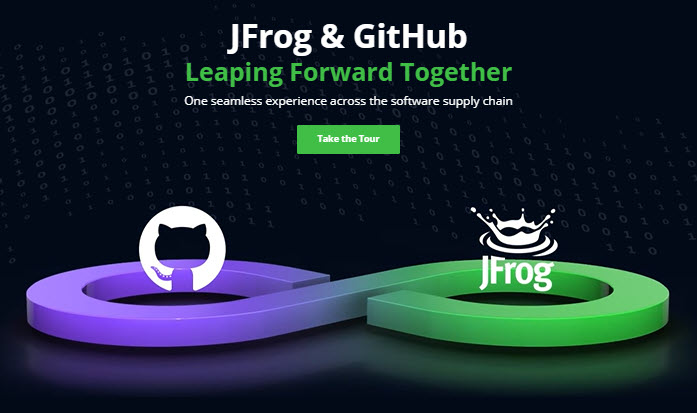
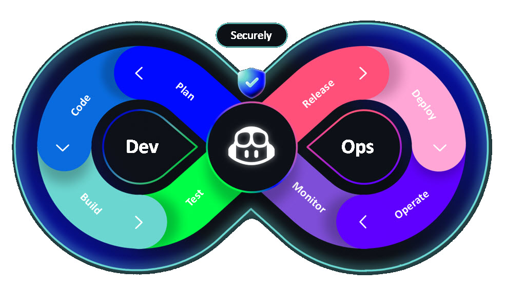

# JFrog / GitHub / Azure Boards Integration

This repo was forked from https://github.com/yonarbel/su2024

[](https://jfrog.com/jfrog-and-github)

## DevOps Resources

<a href="http://aka.ms/DevOps">
  
</a>

- **Plan**: 
  - [DemoJFrogIntegration Dashboard](https://dev.azure.com/daveburnisonms/DemoJFrogIntegration/_dashboards/dashboard/4fd72b49-cb34-4124-b1b4-00d588b33605)
  - [Kanban Board](https://dev.azure.com/daveburnisonms/20e9f5e7-095d-4a16-b5a7-ab629eac49cd/_boards/board/t/7dabdfbe-7b7a-4163-b798-3be24e2ce8e0/Stories/)
- **Code**:
  - GitHub Repo: [https://github.com/devrellabs/DemoJFrogIntegration](https://github.com/devrellabs/DemoJFrogIntegration)
- **Build**:
  - GitHub Actions: [GitHub and JFrog Integration - Build App](https://github.com/devrellabs/DemoJFrogIntegration/actions/workflows/build-App.yml)
  - JFrog Artifactory Builds: [GHJFIntegration](https://ghdevrel.jfrog.io/ui/builds/?projectKey=ghjfintegration&type=builds)
- **Secure**:
  - [GitHub Advanced Security](https://github.com/orgs/devrellabs/security/overview)
  - [JFrog Xray](https://ghdevrel.jfrog.io/ui/scans-list/builds-scans?projectKey=ghjfintegration)

## Recommended IDE Setup

[VSCode](https://code.visualstudio.com/) + [Volar](https://marketplace.visualstudio.com/items?itemName=Vue.volar) (and disable Vetur).

## Customize configuration

See [Vite Configuration Reference](https://vitejs.dev/config/).

## Project Setup

```sh
npm install
```

### Compile and Hot-Reload for Development

```sh
npm run dev
```

### Compile and Minify for Production

```sh
npm run build
```

### Run Unit Tests with [Vitest](https://vitest.dev/)

```sh
npm run test:unit
```

### Run End-to-End Tests with [Playwright](https://playwright.dev)

```sh
# Install browsers for the first run
npx playwright install

# When testing on CI, must build the project first
npm run build

# Runs the end-to-end tests
npm run test:e2e
# Runs the tests only on Chromium
npm run test:e2e -- --project=chromium
# Runs the tests of a specific file
npm run test:e2e -- tests/example.spec.ts
# Runs the tests in debug mode
npm run test:e2e -- --debug
```
